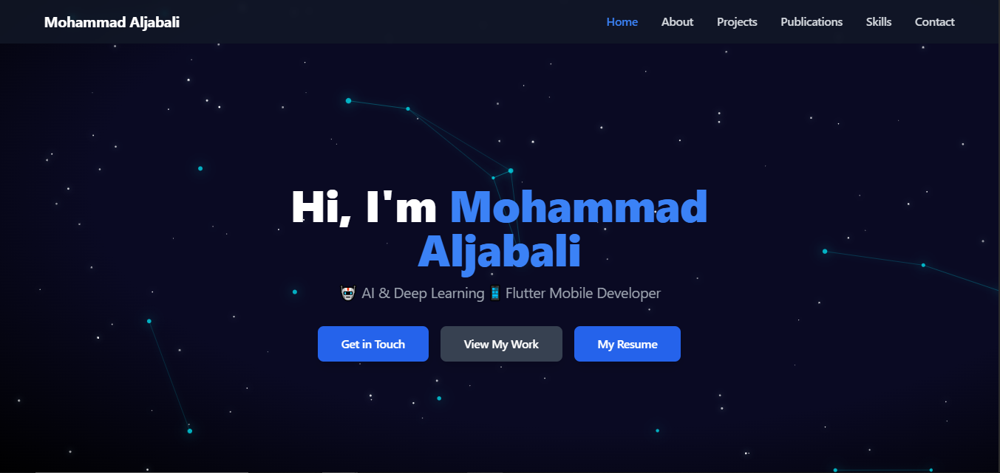

# Personal Portfolio | Mohammad Aljabali

<p align="left">
  
  
  <a href="https://mohammad-aljabali-aljabali89m.vercel.app/" target="_blank">
    
  </a>
</p>

This repository contains the source code for my personal portfolio website, designed to showcase my skills, projects, and publications.

### 🌐 **[View Live Demo](https://mohammad-aljabali.vercel.app/)**

---



## 🤖 About Me

I am an enthusiastic fresh graduate with a strong foundation in Machine Learning, Deep Learning, Computer Vision, and Mobile Application Development using the Flutter framework. I am skilled at designing and deploying AI-driven solutions in user-centric mobile apps and am passionate about harnessing emerging technologies to address complex real-world challenges.

## ✨ Core Features

- **Fully Responsive Design**: Optimized for a seamless experience on all devices, from mobile to desktop.
- **Dynamic Content**: Projects, skills, and publications are loaded from a single data object for easy updates.
- **Project & Publication Showcase**: Features embedded video and image previews.
- **Interactive UI**: Smooth scrolling, hover effects, and a clean, modern aesthetic.
- **CI/CD Pipeline**: Automatically deployed via Vercel on every push to the `main` branch.

## 🛠️ Technology Stack

- **Frontend:** [React.js](https://reactjs.org/)
- **Styling:** [Tailwind CSS](https://tailwindcss.com/)
- **Icons:** [Lucide React](https://lucide.dev/)
- **Deployment & Hosting:** [Vercel](https://vercel.com/)

## 🚀 Getting Started

To get a local copy up and running, follow these simple steps.

### Prerequisites

Make sure you have Node.js (v16 or later) and npm installed on your machine.

### Installation

1.  **Clone the repository**
    ```sh
    git clone [https://github.com/aljabali89m/mohammad-aljabali.git](https://github.com/aljabali89m/mohammad-aljabali.git)
    ```
2.  **Navigate to the project directory**
    ```sh
    cd mohammad-aljabali
    ```
3.  **Install NPM packages**
    ```sh
    npm install
    ```
4.  **Run the development server**
    ```sh
    npm start
    ```
    Open [http://localhost:3000](http://localhost:3000) to view it in your browser.

## 📬 Contact

Feel free to reach out and connect!

- **Email**: `aljabali89m@gmail.com`
- **LinkedIn**: [linkedin.com/in/aljabali89m](https://linkedin.com/in/aljabali89m)
- **GitHub**: [github.com/aljabali89m](https://github.com/aljabali89m)
- **ResearchGate**: [profile/Mohammad-Aljabali](https://www.researchgate.net/profile/Mohammad-Aljabali)
